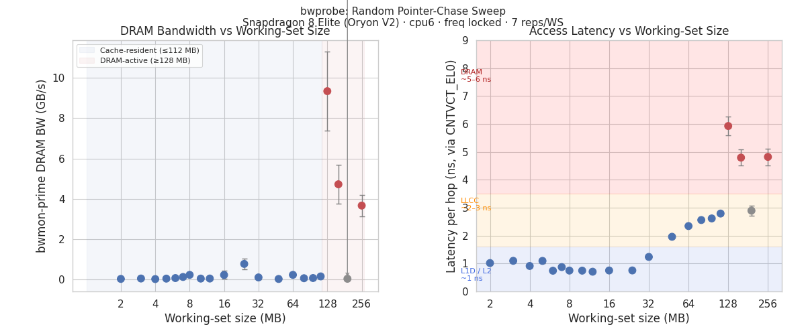
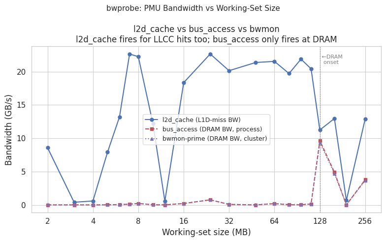
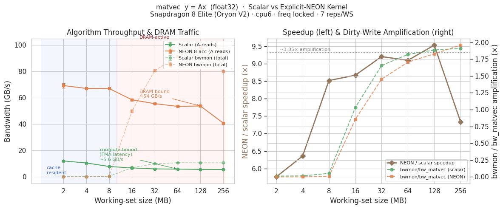

# CPU DRAM Bandwidth Characterization
## Snapdragon 8 Elite (Oryon V2) · Samsung Galaxy S25+

- Random pointer-chase (`bwprobe`) + streaming matvec (`matvec`)
- PMU calibration, cache boundary detection, latency stratification
- DRAM amplification source isolation (`prefault_exp`, `llcc_size`)
- Android 15, kernel 6.6, cpu6 pinned, freq locked to 4,473,600 kHz

---

## Platform & Cache Hierarchy

| Level | Nominal | Empirical | Notes |
|-------|---------|-----------|-------|
| L1D | ~96 KB/core | — | Per core |
| L2 | 12 MB (Prime) | cache ≤ 24 MB | Prime cluster shared |
| LLCC/SLC | "12 MB/slice" | **~112 MB effective** | Multiple slices; all flush sizes agree |
| DRAM | LPDDR5X 128-bit | lat **~5.5 ns/hop** | All IPs share |

- bwmon-llcc-prime: hardware DRAM monitor for cpu6–7 (~4 ms samples)
- `exclude_kernel=0` mandatory — cache refills attributed to kernel on Oryon V2

---

## Measurement Architecture

```
Per rep: flush_caches(24 MB) → warmup (0.5 s) → chase_latency_ns (CNTVCT)
         → [bwmon snap] → 3–5 s workload → [bwmon snap]
```

| Metric | Source | What it measures |
|--------|--------|-----------------|
| `bwmon-prime` | HW tracepoint (`dcvs/bw_hwmon_meas`) | Cluster DRAM BW ground truth |
| `bus_access` (0x0019) | ARM PMU | Per-process DRAM transactions |
| `lat_ns` | CNTVCT_EL0 (no syscall) | Per-hop pointer-chase latency |
| `chase_GBs` | wall clock | Effective pointer-chase throughput |

- `bus_access` at WS ≥ 128 MB: **1.034 ± 0.008×** vs bwmon (21 rep-points)
- `l2d_cache_refill`, `l2d_lmiss_rd`, `l3d_alloc`, LLCC PMU: all broken/inaccessible

---

## bwprobe: Results



- chase_GBs and lat_ns are the **reliable regime indicators** (bwmon noisy in cache regime)
- Both show clean 2× transition at WS = 128 MB

---

## bwprobe: Three-Tier Latency

| WS | lat (ns) | chase (GB/s) | bwmon (MB/s) | Level |
|----|---------|-------------|-------------|-------|
| 2–12 MB | 0.7–1.1 | 22–23 | 20–228 | L1D / L2 |
| 32–112 MB | 1.2–2.8 | 19–22 | 25–772 | LLCC |
| **128 MB** | **5.93** | **10.6** | **9,343** | **DRAM** |
| 160–256 MB | 4.8–5.9 | 12–13 | 3,600–4,700 | DRAM |
| 192 MB | 2.9 | 21.3 | 34 | ZRAM anomaly |

- CNTVCT latency (no syscall overhead): clean 5–6× jump L2→DRAM
- 192 MB anomaly: Android ZRAM compresses buffer pages between reps → collapses to cache-resident

---

## PMU Calibration: bus_access



- `bus_access × 64B / elapsed ≈ bwmon` at WS ≥ 128 MB: **ratio 1.034 ± 0.008**
- In cache regime: `bus_access ≈ background` (~10–228 MB/s) — **correct signal** (no per-process DRAM)
- `l2d_cache`: fires on every L1D miss; use for LLCC contention (not DRAM only)

---

## Metric Selection

| Need | Use |
|------|-----|
| Per-process DRAM BW (WS ≥ 128 MB, freq locked) | `bus_access × 64 / elapsed` (1.034× accurate) |
| Cluster DRAM ground truth | `bwmon-llcc-prime` / `bwmon-llcc-gold` |
| Cache-miss pressure (any level) | `l2d_cache × 64 / elapsed` |
| Per-process DRAM, variable freq | `bwmon` (cluster-level only, no per-process) |

**Cross-processor contention characterization:**
- L1D hit: `l2d_cache = 0` → zero contention ✓
- LLCC hit: `l2d_cache > 0`, `bus_access ≈ 0` → LLCC contention, no DRAM
- DRAM hit: both `l2d_cache > 0` and `bus_access > 0` → full contention

---

## llcc_size: Effective Cache Capacity

Pointer-chase with flush ∈ {24, 128, 256} MB before each rep. `lat_ns` from CNTVCT (reliable).

| WS (MB) | flush=24 lat | flush=128 lat | flush=256 lat | Regime |
|---:|---:|---:|---:|---|
| 32 | 1.68† | 1.23 | 1.24 | cache |
| 64 | 4.92† | 2.31 | 2.30 | cache |
| 96 | 2.65 | 2.63 | 2.62 | cache |
| 112 | 2.72 | 2.73 | 2.74 | cache (boundary) |
| **128** | **5.35** | **5.37** | **5.50** | **DRAM** |

†flush=24 artifact: small scrub competing with WS in LLCC during warmup.

**Finding: all three flush sizes agree — boundary at WS 112→128 MB.**
→ LLCC capacity ≈ **112 MB** (≈ 9× the nominal "12 MB/slice" spec)

---

## matvec: Scalar vs NEON



- M=4096 (y=16 KB L1D-resident); x ≤ 64 KB L1D-resident; **A is sole DRAM pressure**
- Scalar: FMA-latency limited. NEON (8 accumulators): DRAM-bandwidth limited at WS=128 MB

---

## matvec: Why BW Decreases with WS

Scalar: `s += row[j]*x[j]` → clang emits **4-wide NEON FMLA, 1 accumulator** (dep chain on `s`)

| WS | N | dep chain / row | OOO parallelism | BW |
|----|---|----------------|-----------------|-----|
| 2 MB | 128 | 32 iters × 11c = 352c | 2–3 rows in flight | ~12 GB/s |
| 128 MB | 8192 | 2048 × 11c = 22,528c | 1 row fills OOO window | ~5.6 GB/s |

- FMA ceiling: `16B × 4.47 GHz / 11 cycles = 6.5 GB/s` ≈ 5.6 GB/s ✓
- **Short rows → OOO extracts row-level ILP → higher effective accumulator count**
- NEON (8-acc): breaks dep chain → **54 GB/s** at WS=128 MB (DRAM-bandwidth bound)

---

## matvec: DRAM Amplification

`bwmon ≈ 1.88–1.94× bw_matvec` at WS ≥ 128 MB. `prefault_exp.c` isolates the cause.

| Variant | bwmon | bw_alg | amp |
|---------|------:|-------:|----:|
| baseline (flush + write-init) | 11,676 MB/s | 6,005 MB/s | **1.94×** |
| `MADV_DONTNEED` on A | 43 MB/s | 5,996 MB/s | 0.007× (confounded*) |
| `MADV_RANDOM` on A | 11,547 MB/s | 6,005 MB/s | **1.92×** |

*DONTNEED collapses physical pages → zero-page → L1D cached. Not a valid clean-page test.

**Conclusion: amplification is from Oryon V2 hardware stream prefetcher.**
- `MADV_RANDOM` = OS readahead only; CPU hardware prefetcher is architectural, always active
- Prefetcher fetches lines ahead; A >> LLCC → lines evicted before demand → 2× DRAM per line
- Alternative: LPDDR5X 128B burst granularity (indistinguishable from userspace)
- Disabling HW prefetcher requires `CPUACTLR_EL1` (EL1 privilege only)

---

## icc_set_bw: Software Control Loop

`icc_set_bw` tracepoint fires when DCVS updates interconnect bandwidth votes.

| ICC Path | avg_bw | Meaning |
|----------|-------:|---------|
| `chm_apps → qns_llcc` | ~81 GB/s | CPU cluster → LLCC BW vote |
| `llcc_mc → ebi` | ~57 GB/s | LLCC → DRAM controller BW vote |

```
bwmon (~4 ms)  →  DCVS reads  →  ICC vote (~40 ms)  →  DRAM freq/QoS
```

- `icc_set_bw` is aggregate system-wide — not per-process attribution
- Use `bus_access` for per-process; `bwmon` for cluster-level ground truth

---

## Key Findings

1. **DRAM onset: WS = 128 MB** — confirmed by chase_GBs, lat_ns, bwmon; independent of flush size
2. **Effective LLCC ≈ 112 MB** — "12 MB LLCC" = one slice; cpu6 accesses ~9 slices
3. **bus_access: 1.034 ± 0.008×** — accurate at WS ≥ 128 MB; zero in cache regime = correct signal
4. **Scalar: ~5.6 GB/s** — FMA-latency bound (11 cycles); BW drops with WS = OOO row-ILP loss
5. **NEON: ~54 GB/s, 9.5× speedup** — DRAM-bandwidth bound; breaks FMA dep chain
6. **~1.94× DRAM amplification** — HW stream prefetcher; MADV_RANDOM has no effect
7. **icc_set_bw** — DCVS software loop: bwmon (4 ms) → ICC vote (40 ms) → DRAM policy

---

## Open Questions

| Question | Approach |
|----------|----------|
| Confirm prefetcher as amplification cause | Write `CPUACTLR_EL1` (need kernel module) |
| Proper clean-page test | File-backed mmap (not `MADV_DONTNEED`) |
| Multi-processor LLCC contention | CPU + GPU simultaneous; measure `l2d_cache` + bwmon |
| WS=192 MB ZRAM anomaly | Use `mlock()` to prevent page compaction |
| LLCC PMU access | Snapdragon Profiler via proprietary driver |
